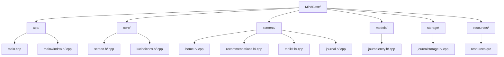
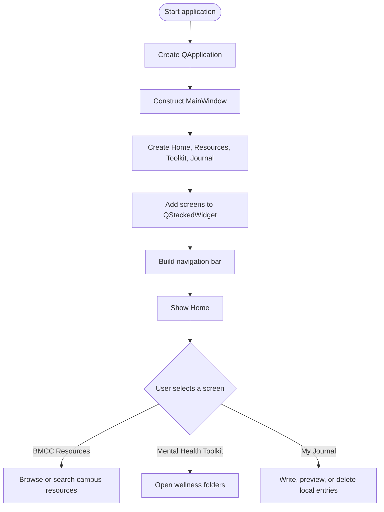
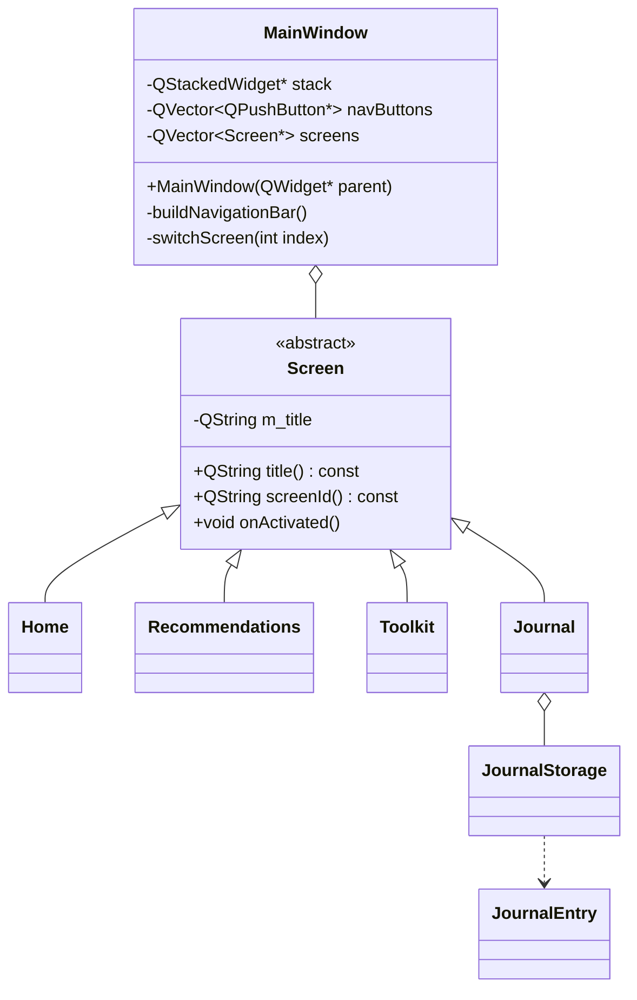

# MindEase Flowchart and UML

These diagrams reflect the current Qt/C++ project structure.

## Project Structure

```mermaid
flowchart TD
    A["MindEase/"] --> B["app/"]
    A --> C["core/"]
    A --> D["screens/"]
    A --> E["models/"]
    A --> F["storage/"]
    A --> G["resources/"]

    B --> B1["main.cpp"]
    B --> B2["mainwindow.h/.cpp"]

    C --> C1["screen.h/.cpp"]
    C --> C2["lucideicons.h/.cpp"]

    D --> D1["home.h/.cpp"]
    D --> D2["recommendations.h/.cpp"]
    D --> D3["toolkit.h/.cpp"]
    D --> D4["journal.h/.cpp"]

    E --> E1["journalentry.h/.cpp"]
    F --> F1["journalstorage.h/.cpp"]
    G --> G1["resources.qrc"]
```

## Main Flow

```mermaid
flowchart TD
    A([Start application]) --> B["Create QApplication"]
    B --> C["Construct MainWindow"]
    C --> D["Create Home, Resources, Toolkit, Journal"]
    D --> E["Add screens to QStackedWidget"]
    E --> F["Build navigation bar"]
    F --> G["Show Home"]
    G --> H{"User selects a screen"}

    H -->|BMCC Resources| I["Browse or search campus resources"]
    H -->|Mental Health Toolkit| J["Open wellness folders"]
    H -->|My Journal| K["Write, preview, or delete local entries"]
```

## Class Diagram

```mermaid
classDiagram
    class MainWindow {
        -QStackedWidget* stack
        -QVector~QPushButton*~ navButtons
        -QVector~Screen*~ screens
        +MainWindow(QWidget* parent)
        -buildNavigationBar()
        -switchScreen(int index)
    }

    class Screen {
        <<abstract>>
        -QString m_title
        +QString title() const
        +QString screenId() const
        +void onActivated()
    }

    class Home
    class Recommendations
    class Toolkit
    class Journal
    class JournalStorage
    class JournalEntry

    Screen <|-- Home
    Screen <|-- Recommendations
    Screen <|-- Toolkit
    Screen <|-- Journal
    MainWindow o-- Screen
    Journal o-- JournalStorage
    JournalStorage ..> JournalEntry
```
