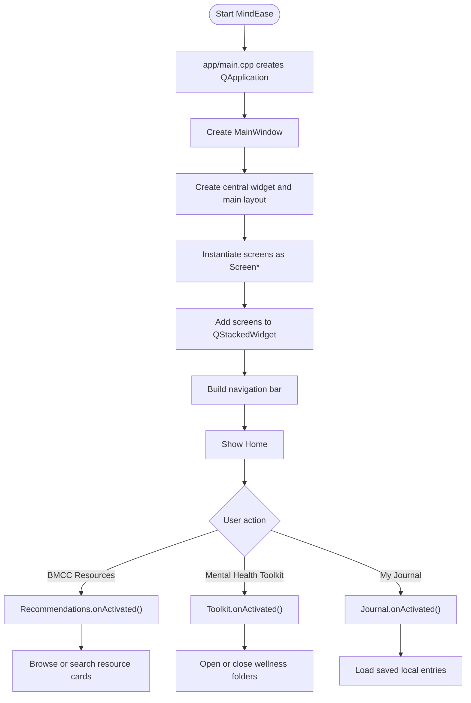
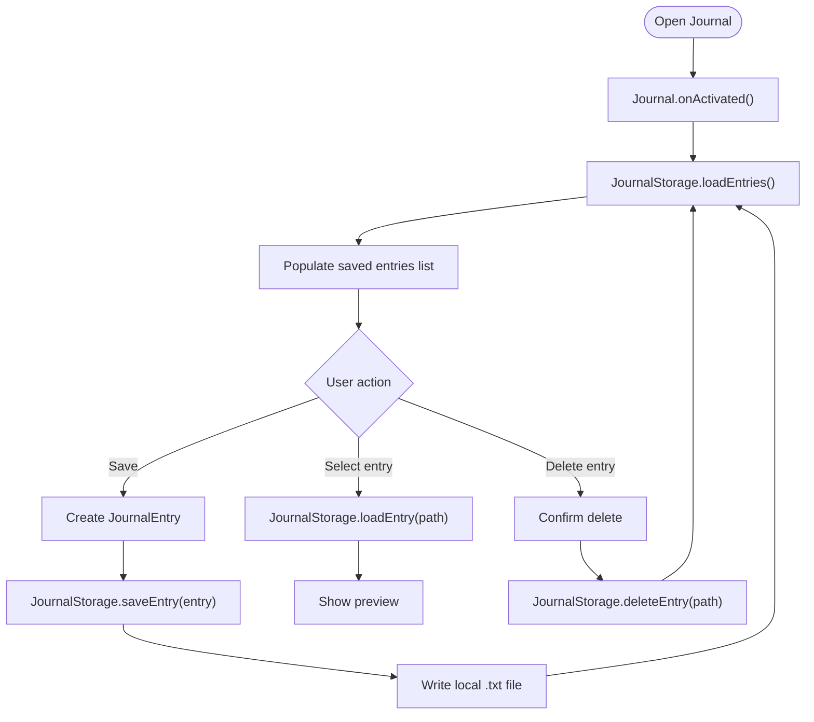
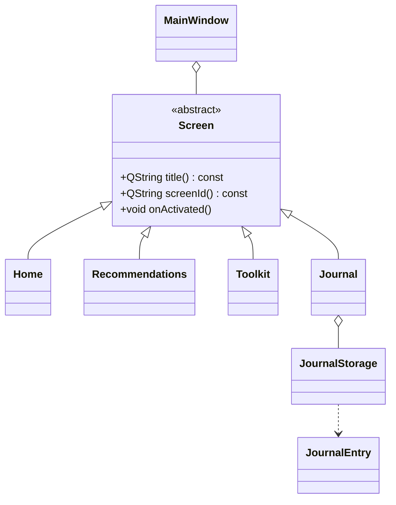

# MindEase Flowchart and UML

This document reflects the current active Qt/C++ application.

## Active Project Structure

```text
MindEase/
|- app/
|  |- main.cpp
|  |- mainwindow.h
|  `- mainwindow.cpp
|- core/
|  |- screen.h / screen.cpp
|  `- lucideicons.h / lucideicons.cpp
|- screens/
|  |- home.h / home.cpp
|  |- recommendations.h / .cpp
|  |- toolkit.h / toolkit.cpp
|  `- journal.h / journal.cpp
|- models/
|  |- journalentry.h
|  `- journalentry.cpp
`- storage/
   |- journalstorage.h
   `- journalstorage.cpp
```

## Application Flowchart



## Journal Flowchart



## Class Diagram


