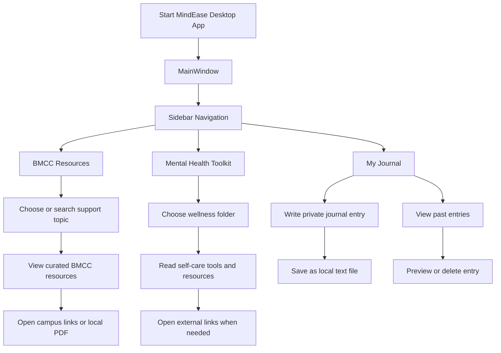

# MindEase — BMCC Wellness Companion

MindEase is a desktop wellness support application built for Borough of Manhattan Community College students. It combines curated BMCC resources, a mental health toolkit, and a private local journal in one calm Qt interface.

This project was created for **CSC211H Advanced Programming Techniques (Honors)** at BMCC / CUNY.

> MindEase is not a therapist, doctor, counselor, diagnosis tool, or emergency service. For emergencies or immediate danger, call 911. In the U.S., call or text 988 for crisis support.

## Features

- **BMCC Resources:** Students can search and browse support topics such as study stress, finance, immigration, health, family, and wellness.
- **Resource Search:** Search can match main topics and subtopics, helping students find support faster.
- **Mental Health Toolkit:** Curated self-care folders for academic stress, mindfulness, connection, sleep, music, identity support, nutrition, and journaling.
- **My Journal:** Private local journal entries saved as plain text files on the user’s machine.
- **Delete Journal Entries:** Saved entries can be removed from the journal screen.
- **Local-first Storage:** Journal files are stored locally, not in a database or cloud account.

## Tech Stack

| Area | Technology |
|---|---|
| Desktop App | C++17, Qt 6 Widgets |
| UI Architecture | `QMainWindow`, `QStackedWidget`, custom `Screen` subclasses |
| Storage | Local text files using Qt file I/O |
| Build System | qmake |

## Application Screens

- **BMCC Resources:** Guided resource finder with search and direct links.
- **Mental Health Toolkit:** Self-care and campus wellness tools.
- **My Journal:** Local journal with save, preview, and delete support.

## Overall Project Flow



## Project Structure

```text
MindEase/
├── MindEase.pro
├── README.md
├── app/
│   ├── main.cpp
│   └── mainwindow.h / mainwindow.cpp
├── core/
│   └── screen.h / screen.cpp
├── models/
│   └── journalentry.h / journalentry.cpp
├── resources/
│   ├── resources.qrc
│   └── 2025-KYR-Final-01.13.202592.pdf
├── screens/
│   ├── home.h / home.cpp
│   ├── journal.h / journal.cpp
│   ├── recommendations.h / recommendations.cpp
│   └── toolkit.h / toolkit.cpp
└── storage/
    └── journalstorage.h / journalstorage.cpp
```

## Setup

### 1. Clone the repository

```bash
git clone <your-repo-url>
cd MindEase
```

### 2. Build and run the Qt app

#### Qt Creator

1. Open Qt Creator.
2. Open `MindEase.pro`.
3. Select a Qt 6 desktop kit.
4. Build and run.

#### Command line

```bash
mkdir -p build/Qt_6_11_0_for_macOS-Debug
/Users/phyothihaoo/Qt/6.11.0/macos/bin/qmake -o build/Qt_6_11_0_for_macOS-Debug/Makefile MindEase.pro -spec macx-clang CONFIG+=debug CONFIG+=qml_debug
make -C build/Qt_6_11_0_for_macOS-Debug -j4
open build/Qt_6_11_0_for_macOS-Debug/MindEase.app
```

Your Qt path may be different. If `qmake` is on your PATH, you can use:

```bash
qmake MindEase.pro
make -j4
```

## Journal Storage

Journal entries are saved as plain text files in:

```text
~/Documents/MindEase_Journal/
```

This keeps the journal local and readable without a database or account.

## C++ Concepts Demonstrated

- Object-oriented programming with classes such as `MainWindow`, `Screen`, `Recommendations`, `Toolkit`, and `Journal`.
- Inheritance through the shared abstract `Screen` base class.
- Polymorphism through `Screen*` storage and virtual screen activation.
- Encapsulation through private UI and storage members.
- File I/O through `JournalStorage`.
- Qt signals and slots for navigation, saving, deleting, and searching.
- Dynamic UI construction from resource data.

## Safety Notes

MindEase provides resource information and journaling tools only. It is not a therapist, doctor, counselor, diagnosis tool, or emergency service.

Emergency resources:

- Call 911 for immediate danger.
- Call or text 988 in the U.S. for crisis support.
- BMCC Counseling Center: Room S-343, (212) 220-8140, counselingcenter@bmcc.cuny.edu.

## Resources

- [BMCC Counseling Center](https://www.bmcc.cuny.edu/student-affairs/counseling/)
- [BMCC Mental Health Toolkit](https://www.bmcc.cuny.edu/student-affairs/counseling/your-mental-health-toolkit/)
- [BMCC Learning Resource Center](https://www.bmcc.cuny.edu/students/lrc/)
- [BMCC Advocacy & Resource Center](https://www.bmcc.cuny.edu/student-affairs/arc/)
- [988 Suicide & Crisis Lifeline](https://988lifeline.org/)

## License

Built for academic purposes at BMCC / CUNY. Resource information belongs to the respective BMCC, CUNY, and external organizations.
